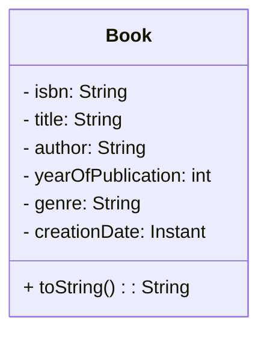

# rest-book

_This microservice is responsible for:_
* Create a Book - POST
## Class Diagram



## Running the application in dev mode

You can run your application in dev mode that enables live coding using:

```shell script
./mvnw compile quarkus:dev
```
## Testing the endpoints
you can test the endpoints by go to the below folder ,and you can find the http requests.
```
/src/main/http
```


> **_NOTE:_**
> * now you can Swagger-Ui at <http://localhost:8702/q/swagger-ui/>.
> * or generate Openapi by <http://localhost:8702/q/openapi/>.

